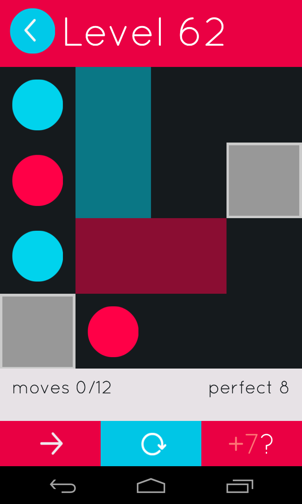

# Puzzles #

## Move: A Brain Shifting Puzzle ##

This program solves the puzzles in the Android game [Move: A Brain Shifting Puzzle](https://play.google.com/store/apps/details?id=com.nitako.move) by [Nitako](https://play.google.com/store/apps/developer?id=Nitako+Brain+Puzzles).
The goal of the game is to move coloured dots onto matching squares.
The dots always move together, unless blocked by a wall.

The program takes input from stdin as follows:
- Two integers, height and width
- (height*width) characters describing the board:
    - 'x' denotes a wall
    - '.' denotes an empty space
    - any other character denotes a goal square
- The number of dots, N, as an integer (should match the number of goal squares)
- N dots, formatted as "y x c", where:
    - y and x are the coordinates from the top left corner, starting at 0
    - c is a character that corresponds to one of the goal squares

For example, Pack 5 Level 62:

The corresponding input file (move_5_62.in) is

    4 4
    .b..
    .b.x
    .rr.
    x...
    4
    0 0 b
    1 0 r
    2 0 b
    3 1 r

The output is

    a solution was found:   rrrddllu

Basically, each arrangement of dots (called a gamestate) is treated as a node.
A breadth first search is performed from the initial node until a solved state is found.

## Nonograms ##

To solve a nonogram, you must fill a grid with black squares.
Each row and column has a list of numbers which denotes the number of black squares required, and how they are to be grouped.
Try it at http://www.puzzle-nonograms.com

The crux of this program is the row_iterator class, which, given a vector describing the groupings of black squares, iterates over every possible way to arrange them. For example, if a row of length 5 must contain blocks of length 2 and 1, there are three ways to achieve this:

* X X _ X _
* X X _ _ X
* _ X X _ X

Notice that in all three cases, the second cell is black.
The nonogram::solve() function iterates over each row and column and collects every arrangement which satisfies the hints and is consistent with the already known cells.
If every arrangement agrees on the identity of a particular cell, its value is recorded.
This procedure is repeated until the puzzle is solved.
This method assumes that the puzzle has a unque solution, otherwise this procedure will repeat indefinitely.

I include an example input file, taken from the above website (25x25, ID: 706,720).
The program solves the puzzle in 10 passes.

I wrote most of this in one sitting, so it could certainly be improved.
The row_iterator class could be improved if it considered the cells which are already known; this would allow the increment function to skip a large number of arrangements.
The first pass would still consider everything, but subsequenty passes would be much quicker.